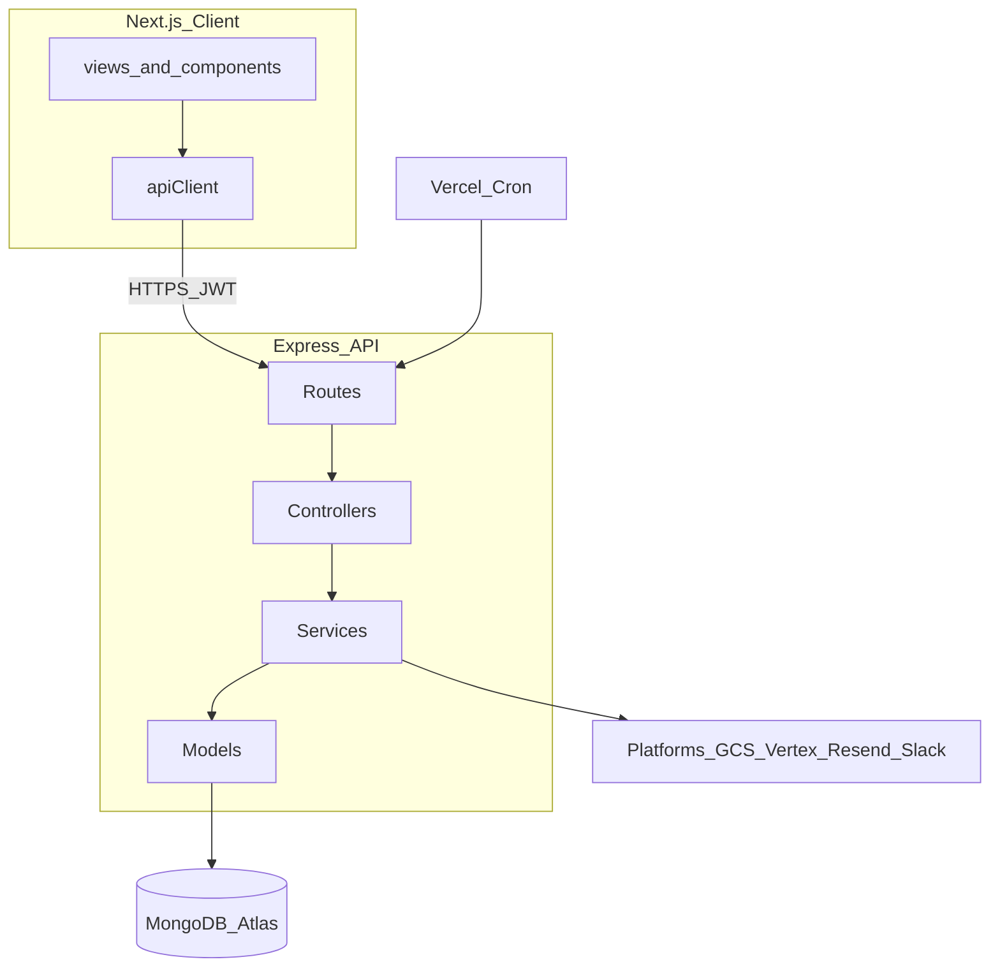

# SyncApp – Architecture & Coding Standards

## Overview

- **Client**: Next.js 16 (App Router), React 19, TypeScript, Tailwind CSS v4.
- **Server**: Express on Vercel, MongoDB Atlas, layered structure (routes → controllers → services → models).



## Client Structure

```
client/
├── app/                 # Next.js App Router (auth + dashboard route groups)
├── src/
│   ├── views/           # Route-level screens (Login, Dashboard, Editor, Settings, Users)
│   ├── components/      # common/, dashboard/, editor/, users/
│   ├── constants/       # messages, designTokens, config, routes
│   ├── contexts/        # AuthContext, ThemeContext
│   ├── hooks/           # usePosts, useEditorState, useToast
│   ├── utils/           # apiClient, contentUtils, logger
│   └── types/           # Shared TypeScript types
```

### Standards

- **Constants**: All user-facing strings in `constants/messages.ts`; design tokens in `designTokens.ts`.
- **Path aliases**: `@components/*`, `@views/*`, `@constants`, `@hooks/*`, `@utils/*`.
- **Views vs components**: Route pages in `app/` dynamically import from `src/views/`.

## Server Structure

```
server/src/
├── config/          # Environment and app config
├── constants/       # HTTP, validation, AI, notifications
├── controllers/     # Request/response; delegate to services
├── middleware/      # ensureDb, auth, errorHandler
├── models/          # User, Post, Credential (Mongoose)
├── routes/          # Mounted under /api
├── services/        # publishService, aiService, notificationService, etc.
└── utils/           # auth, encryption, cache, scheduleUtils
```

### Standards

- **Responses**: `{ success: true, data? }` or `{ success: false, error }`.
- **Errors**: `asyncHandler` + central `errorHandler`; `AppError` for HTTP status.
- **Credentials**: Encrypted at rest; decrypted only during publish.

## Deployment

| App    | Vercel project    | Notes                    |
| ------ | ----------------- | ------------------------ |
| Client | `sync-app-client` | Next.js frontend         |
| Server | `sync-app-server` | Express API + daily cron |

Cron: `GET /api/cron/publish-scheduled` at `0 0 * * *` UTC ([`server/vercel.json`](../server/vercel.json)).

## Related Documentation

- [DATABASE_SCHEMA.md](./DATABASE_SCHEMA.md) — ER diagram and field reference
- [SYSTEM_FLOWS.md](./SYSTEM_FLOWS.md) — Auth, publish, cron, notifications
- [FEATURES.md](./FEATURES.md) — FR/NFR matrix
- [VERCEL_ENV.md](./VERCEL_ENV.md) — Environment variables
- [PROJECT_SYNOPSIS.md](./PROJECT_SYNOPSIS.md) — Product overview
- [BUG_AGENT_AUTOMATION.md](./BUG_AGENT_AUTOMATION.md) — Cursor Cloud Agent auto-fix + PR setup

## Conventions

- **Naming**: PascalCase components; camelCase functions; UPPER_SNAKE constants.
- **TypeScript**: Both client and server use `npm run typecheck`.
- **Logging**: `devLog` / `devWarn` in client; structured logger on server.
