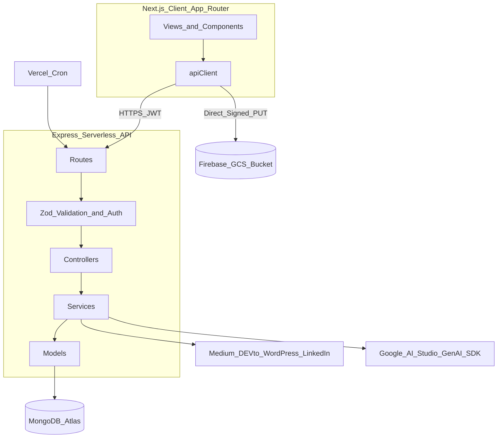

# SyncApp – Architecture & Coding Standards

## Overview

- **Monorepo**: Turborepo + npm workspaces (`client`, `server`, `mobile`).
- **Client**: Next.js 16 (App Router), React 19, TypeScript, Tailwind CSS v4, `next/image` optimization.
- **Server**: Express on Vercel Serverless Functions, MongoDB Atlas (with connection caching via `global.mongooseCache`), Zod request validation, layered structure (routes → middleware → controllers → services → models).


```mermaid
flowchart TB
  subgraph client [Next.js_Client_App_Router]
    Views[Views_and_Components]
    API[apiClient]
    Views --> API
  end
  subgraph server [Express_Serverless_API]
    Middleware[Zod_Validation_and_Auth]
    Routes --> Middleware --> Controllers --> Services --> Models
  end
  API -->|HTTPS_JWT| Routes
  API -->|Direct_Signed_PUT| GCS[(Firebase_GCS_Bucket)]
  Models --> MongoDB[(MongoDB_Atlas)]
  Services --> External[Medium_DEVto_WordPress_LinkedIn]
  Services --> AI[Google_AI_Studio_GenAI_SDK]
  Cron[Vercel_Cron] --> Routes
```

## Client Structure

```
client/
├── app/                 # Next.js App Router (auth + dashboard route groups)
├── src/
│   ├── views/           # Route-level screens (Login, Dashboard, Editor, Settings, Users)
│   ├── components/      # common/ (LazyImage with next/image), dashboard/, editor/, users/
│   ├── constants/       # messages, designTokens, config, routes
│   ├── contexts/        # AuthContext, ThemeContext
│   ├── hooks/           # usePosts, useEditorState, useToast
│   ├── utils/           # apiClient (presigned URL PUT), contentUtils, logger
│   └── types/           # Shared TypeScript types
```

### Standards

- **Constants**: All user-facing strings in `constants/messages.ts`; design tokens in `designTokens.ts`.
- **Path aliases**: `@components/*`, `@views/*`, `@constants`, `@hooks/*`, `@utils/*`.
- **Images**: Rendered via `<LazyImage />` wrapping `next/image` with dynamic sizing (explicit `width`/`height` vs responsive `fill`).

## Server Structure

```
server/src/
├── config/          # Zod-validated environment config
├── constants/       # HTTP, validation, AI, notifications
├── controllers/     # Request/response handlers
├── middleware/      # ensureDb, auth, validation (Zod), errorHandler
├── models/          # User, Post, Credential (Mongoose)
├── routes/          # Mounted under /api
├── schemas/         # Zod request validation schemas
├── services/        # publishService, aiService, storage (presigned URLs), etc.
└── utils/           # auth, AES-256-GCM encryption, cache, scheduleUtils
```

### Standards

- **Responses**: `{ success: true, data? }` or `{ success: false, error }`.
- **Validation**: Strict Zod schemas via `validateBody(schema)` middleware.
- **Errors**: `asyncHandler` + central `errorHandler`; `AppError` for HTTP status.
- **Credentials**: Encrypted at rest via authenticated **AES-256-GCM** (`iv:authTag:ciphertext`).
- **Uploads**: Signed V4 PUT URLs generated via `@google-cloud/storage`, allowing direct client uploads.

## Deployment

| App    | Vercel project    | Root Directory | Notes |
| ------ | ----------------- | -------------- | ----- |
| Client | `sync-app-client` | `client`       | Next.js frontend |
| Server | `sync-app-server` | `server`       | Express API + daily cron (`api/index.ts`) |

Cron: `GET /api/cron/publish-scheduled` at `0 0 * * *` UTC ([`server/vercel.json`](../server/vercel.json)).

## Related Documentation

- [DATABASE_SCHEMA.md](./DATABASE_SCHEMA.md) — ER diagram and field reference
- [SYSTEM_FLOWS.md](./SYSTEM_FLOWS.md) — Auth, publish, presigned uploads, cron
- [FEATURES.md](./FEATURES.md) — FR/NFR matrix
- [VERCEL_ENV.md](./VERCEL_ENV.md) — Environment variables guide
- [PROJECT_SYNOPSIS.md](./PROJECT_SYNOPSIS.md) — Product overview
