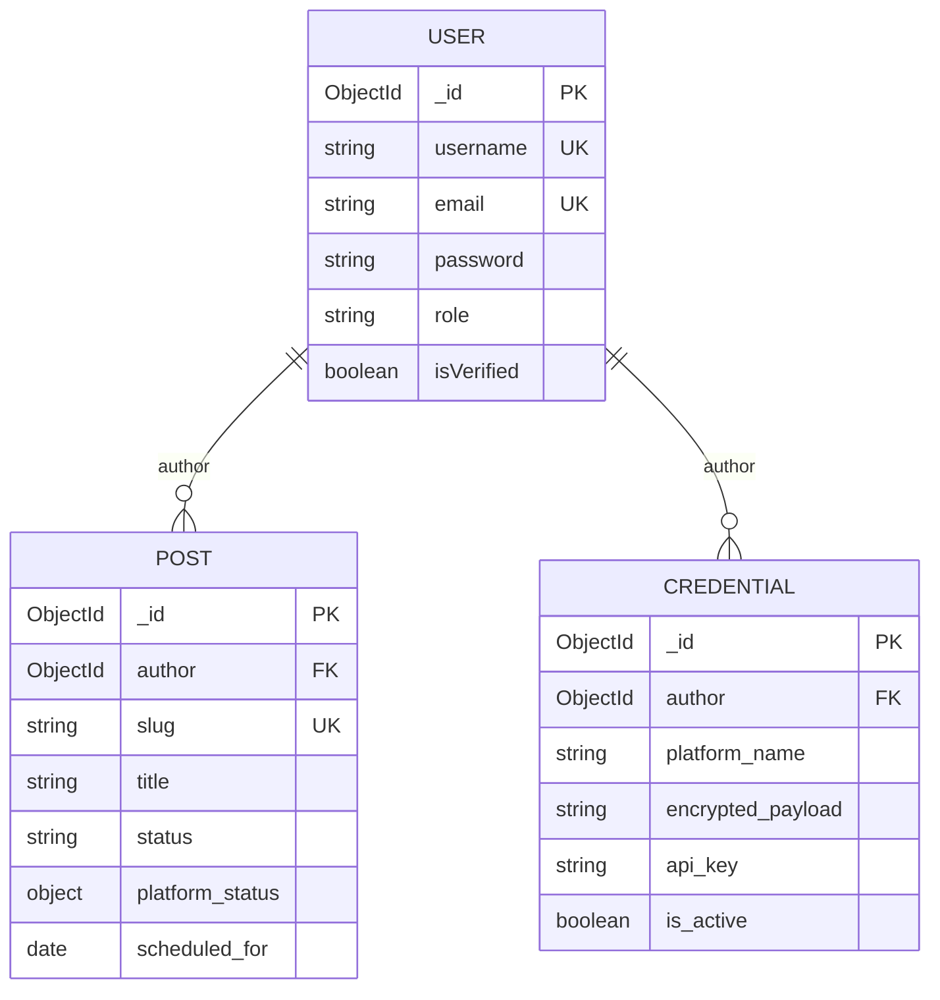

# SyncApp Database Schema

MongoDB Atlas stores three primary collections: **users**, **posts**, and **credentials**. All are defined as Mongoose models under [`server/src/models/`](../server/src/models/).

## Entity Relationship

```mermaid
erDiagram
    USER ||--o{ POST : author
    USER ||--o{ CREDENTIAL : author
    USER {
        ObjectId _id PK
        string username UK
        string email UK
        string password
        string role
        boolean isVerified
    }
    POST {
        ObjectId _id PK
        ObjectId author FK
        string slug UK
        string title
        string status
        object platform_status
        date scheduled_for
    }
    CREDENTIAL {
        ObjectId _id PK
        ObjectId author FK
        string platform_name
        string encrypted_payload
        string api_key
        boolean is_active
    }
```

## User

| Field                   | Type              | Notes             |
| ----------------------- | ----------------- | ----------------- |
| `username`              | String            | Unique, required  |
| `email`                 | String            | Unique, lowercase |
| `password`              | String            | Bcrypt-hashed     |
| `firstName`, `lastName` | String            | Profile           |
| `role`                  | `user` \| `admin` | RBAC              |
| `isVerified`            | Boolean           | Admin-managed     |
| `lastLogin`             | Date              | Optional          |

**Indexes:** `{ role: 1, createdAt: -1 }`

## Post

| Field                    | Type                                 | Notes                            |
| ------------------------ | ------------------------------------ | -------------------------------- |
| `author`                 | ObjectId                             | Ref `User`                       |
| `slug`                   | String                               | Unique, auto from title          |
| `title`                  | String                               | Required                         |
| `content_markdown`       | String                               | Required                         |
| `status`                 | `draft` \| `published` \| `archived` | Default `draft`                  |
| `platform_status`        | Object                               | Per-platform publish state       |
| `tags`                   | String[]                             |                                  |
| `meta_description`       | String                               | Max 160 chars                    |
| `cover_image`            | String                               | Direct GCS / Firebase public URL |
| `canonical_url`          | String                               | SEO                              |
| `linkedin_post`          | String                               | Short LinkedIn teaser text       |
| `linkedin_read_more_url` | String                               | Public article URL for Read more |
| `scheduled_for`          | Date                                 | Cron trigger when due            |

**Indexes:** `{ author, createdAt }`, `{ status, scheduled_for }`

**`platform_status` keys:** `medium`, `devto`, `wordpress`, `linkedin` — each `{ published, post_id, url, published_at }`.

## Credential

| Field               | Type     | Notes                                                       |
| ------------------- | -------- | ----------------------------------------------------------- |
| `author`            | ObjectId | Ref `User`                                                  |
| `platform_name`     | Enum     | `medium`, `devto`, `wordpress`, `linkedin`                  |
| `encrypted_payload` | String   | Authenticated AES-256-GCM packed as `IV:TAG:CIPHERTEXT`     |
| `api_key`           | String   | Synchronized backward-compatible alias for `encrypted_payload` |
| `refresh_token`     | String   | Encrypted; LinkedIn OAuth refresh token                     |
| `token_expires_at`  | Date     | LinkedIn access token expiry                                |
| `site_url`          | String   | Required for WordPress                                      |
| `is_active`         | Boolean  | Only active creds used for publish/cron                     |
| `platform_config`   | Object   | e.g. `devto_username`, `linkedin_person_urn`                |

**Indexes:** Unique compound `{ author: 1, platform_name: 1 }`, `{ author: 1, is_active: 1 }`

## Security & Cryptography

- Platform credentials and access tokens are encrypted at rest using **authenticated AES-256-GCM** ([`server/src/utils/encryption.ts`](../server/src/utils/encryption.ts)).
- Packed payload format: `${ivHex}:${authTagHex}:${ciphertextHex}` using a 12-byte random IV per record.
- Decryption verifies the 16-byte authentication tag in memory during publish operations.
- Backwards compatibility automatically supports legacy unauthenticated tokens during migration.

See also [SYSTEM_FLOWS.md](./SYSTEM_FLOWS.md) and [ARCHITECTURE.md](./ARCHITECTURE.md).
