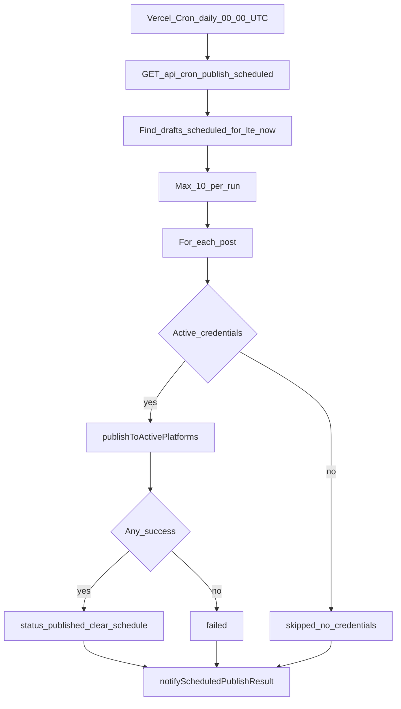

# SyncApp System Flows

## Authentication

1. User registers or logs in via `/api/auth/register` or `/api/auth/login`.
2. Server returns JWT; client stores token and loads `/api/auth/me`.
3. Protected routes require `Authorization: Bearer <token>`.
4. Admin routes additionally check `role === admin`.

## Authoring to Publish

1. User creates/edits post in TipTap editor.
2. Draft saved via `POST/PUT /api/posts`.
3. Optional: AI generate via `/api/ai/generate` (model + `targetPlatforms`: `devto`, `linkedin`), cover via `/api/upload`.
4. User publishes to one platform or all connected platforms.
5. `publishService` decrypts credentials, calls external APIs, updates `platform_status`.
6. On full success, `status` becomes `published`.

## AI Post Generation

1. Editor opens **Generate Post** modal — user picks keyword, **Gemini model** (static client list), and optimization targets (DEV.to, LinkedIn, or both).
2. Client sends `POST /api/ai/generate` with `{ keyword, model?, targetPlatforms? }`.
3. Server validates model against allowlist and targets against `devto` / `linkedin`.
4. `buildFullPostSystemPrompt(targets)` merges base SEO rules with platform-specific instructions (blended when both selected).
5. Vertex AI returns JSON `{ title, meta_description, tags, content_markdown }`; client fills the editor.

**Key files:** [`aiController.ts`](../server/src/controllers/aiController.ts), [`aiService.ts`](../server/src/services/aiService.ts), [`platformOptimization.ts`](../server/src/constants/platformOptimization.ts), [`GeneratePostModal.tsx`](../client/src/components/editor/GeneratePostModal.tsx).

**Phase 2 (planned):** LinkedIn OAuth credentials + `publishToLinkedin` — same draft optimized in Phase 1 can be published without re-generation.

## Smart Publish Menu

Editor loads `GET /api/credentials` and shows only platforms with active credentials. Publish is disabled when none are connected.

## Credential Disconnect

`DELETE /api/credentials/:platform` removes stored credentials. Cron and manual publish skip inactive or missing credentials.

## Scheduled Publishing (Cron)

**Outcomes:** `success`, `partial`, `failed`, `skipped_no_credentials`.

**Key files:** [`cronController.ts`](../server/src/controllers/cronController.ts), [`publishService.ts`](../server/src/services/publishService.ts), [`scheduleUtils.ts`](../server/src/utils/scheduleUtils.ts).

## Notifications

After each scheduled publish attempt, `notificationService` sends in parallel:

- **Slack** — Block Kit message via `SLACK_WEBHOOK_URL` (optional)
- **Email** — HTML via Resend to author (`RESEND_API_KEY`, `NOTIFICATION_FROM_EMAIL`)

## Image Upload

1. Client uploads file to `POST /api/upload`.
2. Server stores in Google Cloud Storage.
3. Public URL saved as `cover_image` and embedded in markdown.
4. Same URL reused when syndicating to all platforms.
