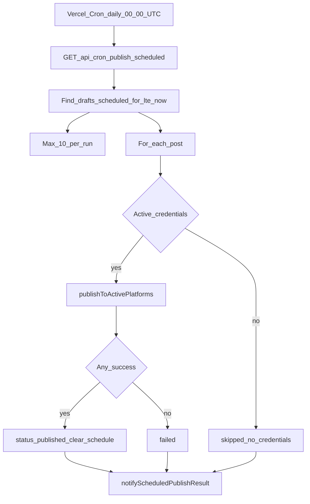

# SyncApp System Flows

## Authentication

1. User registers or logs in via `/api/auth/register` or `/api/auth/login`.
2. Server validates input using **Zod** schemas and returns JWT; client stores token and loads `/api/auth/me`.
3. Protected routes require `Authorization: Bearer <token>`.
4. Admin routes additionally check `role === admin`.

## Authoring to Publish

1. User creates/edits post in TipTap editor.
2. Draft saved via `POST/PUT /api/posts`.
3. Optional: AI generate via `/api/ai/generate` (model + `targetPlatforms`: `devto`, `linkedin`), cover via direct GCS presigned upload (`POST /api/upload/presigned-url`).
4. User publishes to one platform or all connected platforms.
5. `publishService` decrypts credentials using **AES-256-GCM**, calls external APIs, updates `platform_status`.
6. On full success, `status` becomes `published`.

## AI Post Generation

1. Editor opens **Generate Post** modal — user picks keyword, **Gemini model** (static client list), and optimization targets (DEV.to, LinkedIn, or both).
2. Client may call `GET /api/ai/capabilities` (`textAi`, `imageAi`, `provider`).
3. Client sends `POST /api/ai/generate` with `{ keyword, model?, targetPlatforms? }`.
4. Server validates model against allowlist and targets against `devto` / `linkedin`.
5. Text and image AI use **Google AI Studio** (`GEMINI_API_KEY` via `@google/genai` SDK — no Vertex required).
6. `buildFullPostSystemPrompt(targets)` merges base SEO rules with platform-specific instructions; response is parsed as JSON (`schemas.ts`).
7. Client fills the editor with the full article `{ title, meta_description, tags, content }`.
8. When **LinkedIn** is selected, the response also includes `linkedin_post` (short teaser) + `read_more_url` from `CANONICAL_BASE_URL`/`SITE_URL` + slug. The editor persists these on the Post (`linkedin_post`, `linkedin_read_more_url`) and shows a **LinkedIn summary** panel with Copy + Publish. If the blog base URL is unset, the teaser is still returned with `linkedin_missing_canonical: true` (no invented domain).

**Key files:** [`server/src/ai/`](../server/src/ai/), [`aiController.ts`](../server/src/controllers/aiController.ts), [`platformOptimization.ts`](../server/src/constants/platformOptimization.ts), [`linkedinPost.ts`](../server/src/utils/linkedinPost.ts), [`GeneratePostModal.tsx`](../client/src/components/editor/GeneratePostModal.tsx), [`LinkedInPostPanel.tsx`](../client/src/components/editor/LinkedInPostPanel.tsx).

**Setup:** see [`docs/AI_SETUP.md`](./AI_SETUP.md). Set `CANONICAL_BASE_URL` / `NEXT_PUBLIC_CANONICAL_BASE_URL` to your **public blog** (e.g. `https://www.farukh.me/blog`) for LinkedIn Read more. Keep `SITE_URL` as the **SyncApp client** for auth, editor, and OAuth return.

## LinkedIn OAuth + publish

1. Settings → **Connect with LinkedIn** → `GET /api/linkedin/oauth/start` returns authorize URL (JWT-signed state).
2. Member approves scopes `openid profile w_member_social`; callback `GET /api/linkedin/oauth/callback` exchanges code, fetches person URN via userinfo, stores encrypted access/refresh tokens on Credential using AES-256-GCM (`platform_name: linkedin`, `encrypted_payload`).
3. Editor **Publish to LinkedIn** (or Publish All / scheduled cron) calls `publishToLinkedin`, which posts the **saved summary** via UGC Posts API — never the full TipTap article.
4. Empty `linkedin_post` → clear error; LinkedIn unpublish from SyncApp is unsupported.

**Env:** `LINKEDIN_CLIENT_ID`, `LINKEDIN_CLIENT_SECRET`, `LINKEDIN_REDIRECT_URI` (must match the LinkedIn app callback, e.g. `https://…/api/linkedin/oauth/callback`). Also set `SITE_URL` so OAuth redirects back to `/settings`.

## Smart Publish Menu

Editor loads `GET /api/credentials` and shows only platforms with active credentials (Medium, DEV.to, WordPress, LinkedIn). Publish is disabled when none are connected.

## Credential Management & Authenticated Security

- `PUT /api/credentials/:platform` validates input via Zod (`upsertCredentialSchema`), encrypts API key using authenticated **AES-256-GCM** (`${ivHex}:${authTagHex}:${ciphertextHex}`), and persists into `encrypted_payload`.
- `DELETE /api/credentials/:platform` removes stored credentials. Cron and manual publish skip inactive or missing credentials.

## Scheduled Publishing (Cron)

```mermaid
flowchart TD
  cron[Vercel_Cron_daily_00_00_UTC] --> api[GET_api_cron_publish_scheduled]
  api --> find[Find_drafts_scheduled_for_lte_now]
  find --> limit[Max_10_per_run]
  find --> loop[For_each_post]
  loop --> creds{Active_credentials}
  creds -->|no| skip[skipped_no_credentials]
  creds -->|yes| pub[publishToActivePlatforms]
  pub --> result{Any_success}
  result -->|yes| done[status_published_clear_schedule]
  result -->|no| fail[failed]
  done --> notify[notifyScheduledPublishResult]
  fail --> notify
  skip --> notify
```

**Outcomes:** `success`, `partial`, `failed`, `skipped_no_credentials`.

**Key files:** [`cronController.ts`](../server/src/controllers/cronController.ts), [`publishService.ts`](../server/src/services/publishService.ts), [`scheduleUtils.ts`](../server/src/utils/scheduleUtils.ts).

## Notifications

After each scheduled publish attempt, `notificationService` sends in parallel:

- **Slack** — Block Kit message via `SLACK_WEBHOOK_URL` (optional)
- **Email** — HTML via Resend to author (`RESEND_API_KEY`, `NOTIFICATION_FROM_EMAIL`)

## Image Upload (Direct-to-GCS Presigned URLs)

1. Client requests a signed V4 PUT upload URL by sending `{ filename, size, contentType }` to `POST /api/upload/presigned-url` (validated via Zod).
2. Server generates a 15-minute cryptographically signed V4 PUT URL using `@google-cloud/storage`.
3. Client executes an HTTP `PUT` directly to Google Cloud Storage / Firebase Storage, completely bypassing serverless memory limits.
4. Resolved public CDN URL is saved as `cover_image` and embedded in markdown.
